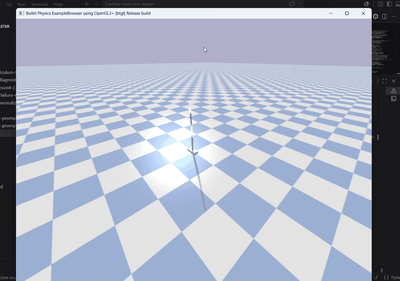
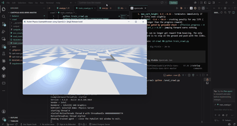

# CartPole-Goes-Brrr

A reinforcement learning playground where a single cartpole assembly gets put
through increasingly ridiculous jobs. The goal: learn RL by making the same
dumb physics rig do things it was never designed for.

## The Journey

It starts simple. You have a cart on a rail with a pendulum attached.
Classic control theory problem, except we're not doing control theory — we're
throwing PPO at it and hoping the math gods smile upon us.

### Task 1: Balance (single link — the classic)


The textbook cartpole. One link, one rail, one job: stay upright.
If it falls, you know exactly who to blame.

**What you learn here:** reward shaping, why a survival bonus is a dangerously
addictive crutch, and that even the "hello world" of RL can humiliate you.

### Task 2: Balance (two links — why not)



Same rail, same job — except now there are two asymmetric links and one of them
keeps flailing. The hip gets 65% of the uprightness weight because it failed
90% of the time before we started playing favourites.

**What you learn here:** asymmetric weighting, curriculum starts, and that
adding more joints makes everything worse in ways you didn't predict.

### Task 3: Crawl (the questionable one)



Remove the rail. Drop the whole thing on the floor. The cart is free to
slide anywhere. And instead of the cart balancing the pole, the **pole has to
crawl** — using its own joint torques to push against the ground and drag the
cart forward like an inchworm having an existential crisis.

**What you learn here:** sparse rewards, why your agent learns to jump instead
of crawl, and that making links touch the ground in PyBullet is harder than it
sounds.

| Task | Folder | Objective | Action space |
|------|--------|-----------|---------------|
| **Balance (1L)** | [`balance_1_link/`](balance_1_link) | Keep the pole upright on a rail | 1D force on cart |
| **Balance (2L)** | [`balance_2_links/`](balance_2_links) | Keep the double pendulum upright | 1D force on cart |
| **Crawl** | [`crawl/`](crawl) | Use joint torque to drag the cart forward | 2D torque `[hip, elbow]` |

## Structure

```
CartPole-Goes-Brrr/
├── balance_1_link/      # the classic one-link
├── balance_2_links/     # the extra-jointed sequel
├── crawl/               # the questionable one
├── requirements.txt
└── README.md
```

Each folder is self-contained with its own URDF, env, training script, and
output directory. Same physics engine (PyBullet), same algorithm (SB3 PPO),
same suffering — different reward functions.

## Setup

```bash
pip install -r requirements.txt
```

## Quickstart

```bash
cd balance_1_link && python train.py              # keep it upright
cd balance_2_links && python train.py             # keep it upright (harder)
cd crawl && python train_crawl.py                 # make it move (good luck)
```

Watch trained agents:

```bash
cd balance_1_link && python train.py --mode eval  # simple balance
cd balance_2_links && python train.py --mode eval # double balance
cd crawl && python eval_crawl.py                  # crawl
```

Training logs go to `output/tensorboard/` in each folder — view with
`tensorboard --logdir output/tensorboard`.

## What this repo is actually about

This is a learning project. The cartpole is just a vehicle (literally) for
exploring RL concepts through hands-on experiments:

- **Reward engineering** — turns out telling an agent *what* you want is the
  hard part, not the algorithm
- **Curriculum design** — start easy, make it harder, watch the agent cry
- **Exploration vs exploitation** — why does my agent do nothing? why does my
  agent jump? why does my agent spin in circles?
- **Sim-to-reality gaps** — even in simulation, physics engines have opinions

Every bug fixed and every reward re-shaped is a lesson learned. The commit
history is the textbook.

## Tech Stack

- **Physics:** PyBullet
- **RL Framework:** [Stable Baselines3](https://github.com/DLR-RM/stable-baselines3) (PPO)
- **Environment:** Gymnasium (custom)
- **Model:** MLP policy (MlpPolicy)
- **Normalization:** VecNormalize for obs/reward

## Upcoming Tasks

- [ ] Spin — make the pendulum rotate continuously around the cart
- [ ] Crawl on a rail — constrained crawling along a prismatic joint
- [ ] Crawl (multi-direction) — crawl in any direction, not just forward
- [ ] Inverted balance — single link stands on the pole instead of the cart
