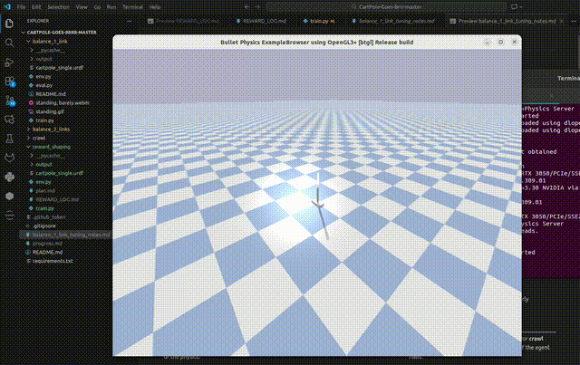

# Balance — Single Link



A single-pendulum-on-rail balance task, adapted from the two-link version.

| Spec | Value |
|------|-------|
| URDF | `cartpole_single.urdf` — cart (1kg) + one link (0.5kg, 1.0m) |
| Action | 1D continuous force [-50, 50] N on cart |
| Observation | 4 values: `[cart_pos, cart_vel, pole_angle, pole_angvel]` |
| Reward | cos(pole_angle) + survival + penalties (pos, vel, control) + settled bonus |
| Termination | Rail limit > 2.4m OR pole angle > 86deg |
| Max steps | 500 |
| Curriculum | 30% of episodes start with pole velocity up to ±4 rad/s |

## Usage

```bash
# Train
python train.py

# Train with custom timesteps
python train.py --timesteps 100000

# Evaluate with GUI
python train.py --mode eval

# Diagnose failure modes (headless)
python eval.py diagnose
```

Training logs: `output/tensorboard/` — view with `tensorboard --logdir output/tensorboard`.

## Key Files

- `env.py` — `SinglePendulumCartEnv(gym.Env)`
- `train.py` — PPO training with VecNormalize + checkpointing
- `eval.py` — GUI playback and diagnostic termination analysis
- `cartpole_single.urdf` — URDF with prismatic rail joint + passive revolute joint
